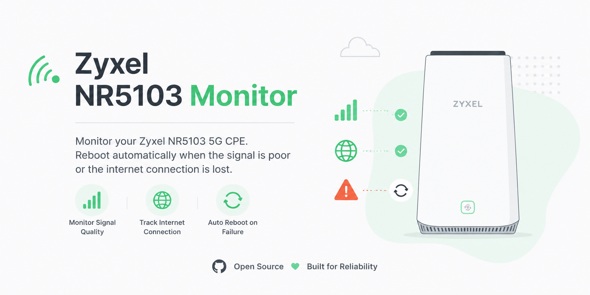

<div align="center">
  
</div>

# zyxel-nr5103-monitor

A Rust watchdog that monitors internet connectivity and 5G signal quality on the Zyxel NR5103 CPE, then recovers the connection automatically when something breaks.

[English](README.md) | [中文](README_ZH.md)

## What it does

The monitor logs into your Zyxel NR5103 router over HTTP or HTTPS, then runs two checks on a timer: can it reach the internet, and is the 5G signal strong enough. When either check fails repeatedly, it tries to fix things -- first by reloading the access technology settings, and if that doesn't work, by rebooting the router. It re-authenticates automatically when the session expires.

It runs as a systemd service, so it starts on boot and restarts if it crashes.

## Features

- HTTP and HTTPS login with RSA/AES encryption support
- Periodic internet connectivity checks via HTTP
- Optional 5G signal quality monitoring with configurable RSRP thresholds
- Automatic session re-authentication
- Two-stage recovery: access technology reload, then reboot as fallback
- OpenTelemetry metrics export (OTLP gRPC and HTTP/protobuf)
- TOML configuration with layered file sources
- Static musl builds for x86_64 and aarch64
- Systemd service deployment

## Quick start

### Requirements

- Rust toolchain (install via [rustup](https://rustup.rs/))
- For musl cross-builds: `clang`, `llvm-ar`, and the corresponding Rust musl target

### Build

```bash
cargo build --release
```

### Configure

Copy the example config and edit it for your router:

```bash
cp config.example.toml config.toml
```

At minimum, set your router's IP address and login credentials:

```toml
[router]
host = "172.16.0.1"
username = "admin"
password = "your-password"
```

### Run

```bash
cargo run --release
```

The monitor logs in, fetches device info, and starts the monitoring loop. Press `Ctrl+C` to stop.

## Configuration

The application loads config from the first available TOML source in this order:

1. `./config.toml`
2. `$HOME/.config/nr5103/config.toml`
3. `/etc/nr5103/config.toml`

Later sources override earlier ones. See [`config.example.toml`](config.example.toml) for all available options with comments.

### Key settings

| Section | Setting | Default | Description |
|---------|---------|---------|-------------|
| `[router]` | `host` | -- | Router IP address |
| `[router]` | `protocol` | `http` | `http` or `https` |
| `[monitor]` | `interval` | `60` | Seconds between checks |
| `[monitor]` | `max_retries` | `1` | Consecutive failures before recovery |
| `[monitor]` | `recovery_method` | `reload` | `reload` or `reboot` |
| `[monitor.signal]` | `enabled` | `false` | Enable 5G signal monitoring |
| `[monitor.signal]` | `require_5g` | `false` | Treat non-5G fallback as degraded |
| `[monitor.signal]` | `min_5g_rsrp` | `-110` | Minimum 5G RSRP (dBm) |
| `[telemetry]` | `endpoint` | -- | OTLP endpoint URL |
| `[telemetry.metrics]` | `enabled` | `false` | Enable metrics export |

### How recovery works

The `reload` recovery method (the default) does this:

1. Switch the preferred access technology from its current value to `NR5G-SA`
2. Wait, then switch it back to the original value
3. If the monitored condition is still unhealthy, reboot the router

The `reboot` method skips the reload step and reboots immediately.

## Deployment

Systemd service files are in `deploy/`. To install as a system service:

```bash
sudo useradd -r -s /usr/sbin/nologin monitor
sudo install -D -m 640 -o monitor config.toml /opt/zyxel-nr5103-monitor/config.toml
sudo install -D -m 755 target/release/zyxel-nr5103-monitor /opt/zyxel-nr5103-monitor/zyxel-nr5103-monitor
sudo install -m 644 deploy/zyxel-nr5103-monitor.service /etc/systemd/system/
sudo systemctl daemon-reload
sudo systemctl enable --now zyxel-nr5103-monitor
```

View logs:

```bash
journalctl -u zyxel-nr5103-monitor -f
```

For musl builds, replace the binary path with the target-specific output (e.g., `target/x86_64-unknown-linux-musl/release/zyxel-nr5103-monitor`).

## Cross-compilation

```bash
rustup target add x86_64-unknown-linux-musl
cargo build --release --target x86_64-unknown-linux-musl
```

To make aarch64 the default target, edit `.cargo/config.toml`.

## OpenTelemetry

The monitor can export metrics via OTLP. All telemetry signals are disabled by default.

Enable metrics export:

```toml
[telemetry]
endpoint = "http://localhost:4317"
protocol = "grpc"       # or "http/protobuf"
export_interval = 60

[telemetry.metrics]
enabled = true
```

The telemetry module strips sensitive identifiers (IMEI, IMSI, IP addresses, MAC addresses, session keys) before exporting.

### Exported metrics

#### Device and system

| Name | Type | Unit | Attributes | Description |
|------|------|------|------------|-------------|
| `zyxel.device.uptime.seconds` | Gauge | `s` | -- | Device uptime |
| `zyxel.system.cpu.usage.percent` | Gauge | `%` | -- | CPU usage |
| `zyxel.system.memory.bytes` | Gauge | `By` | `state` = `total`/`free` | Total and free memory |

#### Cellular signal

| Name | Type | Unit | Attributes | Description |
|------|------|------|------------|-------------|
| `zyxel.cellular.signal.dbm` | Gauge | `dBm` | `radio`, `kind` | Signal strength (RSSI, RSRP) |
| `zyxel.cellular.signal.db` | Gauge | `dB` | `radio`, `kind` | Signal quality (RSRQ, SINR) |

`radio` values: `lte`, `nr_nsa`, `scc` | `kind` values: `rssi`, `rsrp`, `rsrq`, `sinr`

#### Network interfaces

| Name | Type | Unit | Attributes | Description |
|------|------|------|------------|-------------|
| `zyxel.interface.traffic.bytes` | Counter | `By` | `interface_type`, `interface_name`, `direction` | Traffic bytes (delta per export) |
| `zyxel.interface.traffic.packets` | Counter | `{packet}` | `interface_type`, `interface_name`, `direction` | Traffic packets (delta per export) |
| `zyxel.interface.errors` | Counter | `{error}` | `interface_type`, `interface_name`, `direction` | Interface errors (delta per export) |
| `zyxel.interface.discards` | Counter | `{packet}` | `interface_type`, `interface_name`, `direction` | Interface discards (delta per export) |

`interface_type` values: `ip`, `ethernet` | `direction` values: `sent`, `received`

#### LAN ports

| Name | Type | Unit | Attributes | Description |
|------|------|------|------------|-------------|
| `zyxel.lan.port.up` | Gauge | -- | `port_name` | `1` = link up, `0` = link down |

#### Connectivity monitoring

| Name | Type | Unit | Description |
|------|------|------|-------------|
| `zyxel.monitor.connectivity.rtt.ms` | Histogram | `ms` | Round-trip latency of connectivity checks |
| `zyxel.monitor.connectivity.failures` | Counter | -- | Connectivity check failure count |

#### Signal-quality monitoring

| Name | Type | Unit | Attributes | Description |
|------|------|------|------------|-------------|
| `zyxel.monitor.signal.degraded` | Counter | -- | `reason` | Degraded signal-quality checks |
| `zyxel.monitor.signal.recovery.attempts` | Counter | -- | -- | Recovery attempts triggered by signal |
| `zyxel.monitor.signal.recovery.successes` | Counter | -- | -- | Successful signal recoveries |
| `zyxel.monitor.signal.recovery.failures` | Counter | -- | -- | Failed signal recoveries |

`reason` values: `missing_5g`, `weak_5g_rsrp`

#### Recovery: reboot

| Name | Type | Unit | Description |
|------|------|------|-------------|
| `zyxel.monitor.reboot.attempts` | Counter | -- | Reboot recovery attempts |
| `zyxel.monitor.reboot.successes` | Counter | -- | Successful reboot commands |

#### Recovery: reload

| Name | Type | Unit | Description |
|------|------|------|-------------|
| `zyxel.monitor.reload.attempts` | Counter | -- | Reload recovery attempts |
| `zyxel.monitor.reload.successes` | Counter | -- | Reloads that restored the monitored condition |
| `zyxel.monitor.reload.failures` | Counter | -- | Reloads that did not restore the condition |
| `zyxel.monitor.reload.duration.seconds` | Histogram | `s` | Total duration of reload recovery cycles |

## Technical notes

- HTTP mode fetches the router's RSA public key and encrypts login credentials. HTTPS mode skips this and sends plain JSON.
- Self-signed router certificates are accepted intentionally for local-network usage.
- The `config` crate handles layered TOML sources, so later files override earlier ones.
- Metrics collection failures are logged but do not trigger recovery.

---

*This project is not affiliated with, endorsed by, or connected to Zyxel Group Corporation or its subsidiaries. Zyxel is a trademark of its respective owner. This is an independent, third-party project.*

---

<div align="center">
  <sub>Built with <a href="https://opencode.ai/">OpenCode</a> &middot; AI-assisted development</sub>
  <br>
  <sub>Released under the <a href="LICENSE">MIT License</a></sub>
</div>
